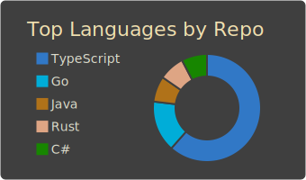
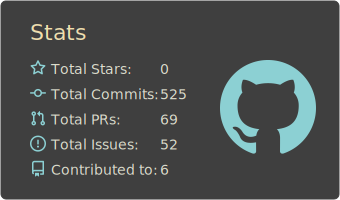
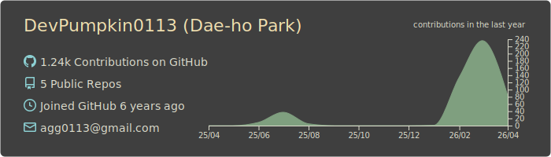
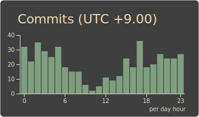

---


**안녕하세요, 개발자 박대호입니다.** 👋

백엔드부터 프론트엔드, 게임까지 다양한 영역을 넘나들며 경험을 쌓고 있습니다.  
현재는 [**팀 투스리스**](https://github.com/TeamTooThless99)에서 미니앱과 게임을 활발히 출시 중입니다.  
사용자 경험을 고려한 UI/UX에도 관심이 많고, 작은 아이디어도 직접 만들어 배포해보는 것을 즐깁니다.

```
🔧 Language  : Java · TypeScript · Go
🚀 Framework : Spring · React
🗄️ Database  : MySQL · Redis · MongoDB
🛠️ Tools     : Git · Docker · Linux · Figma
```

---

<div align="left">
    
    
    
    <!--  -->
</div>

---

<table>
  <tr>
    <td align="center"><a href="https://velog.io/@tto0113"></a></td>
    <td align="center"><a href="mailto:agg0113@gmail.com"></a></td>
    <!-- <td align="center"><a href="https://ko-fi.com/devpumpkin"></a></td> -->
  </tr>
  <tr>
    <td align="center"></td>
    <td align="center"></td>
    <!-- <td align="center"></td> -->
  </tr>
</table>
